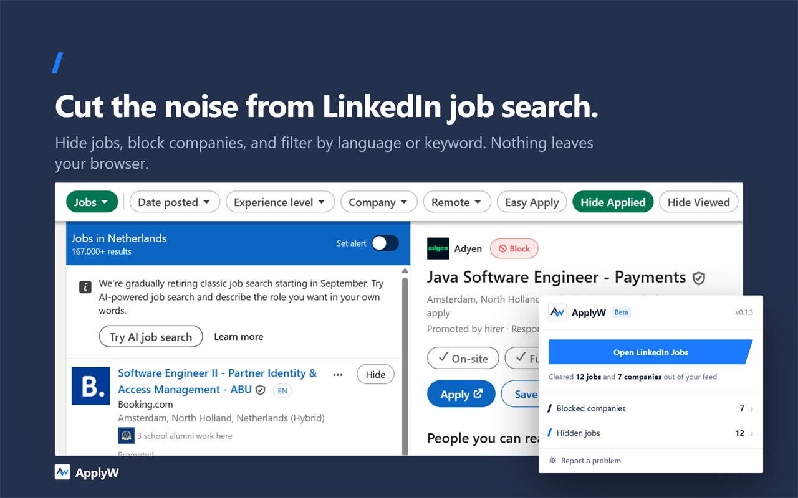
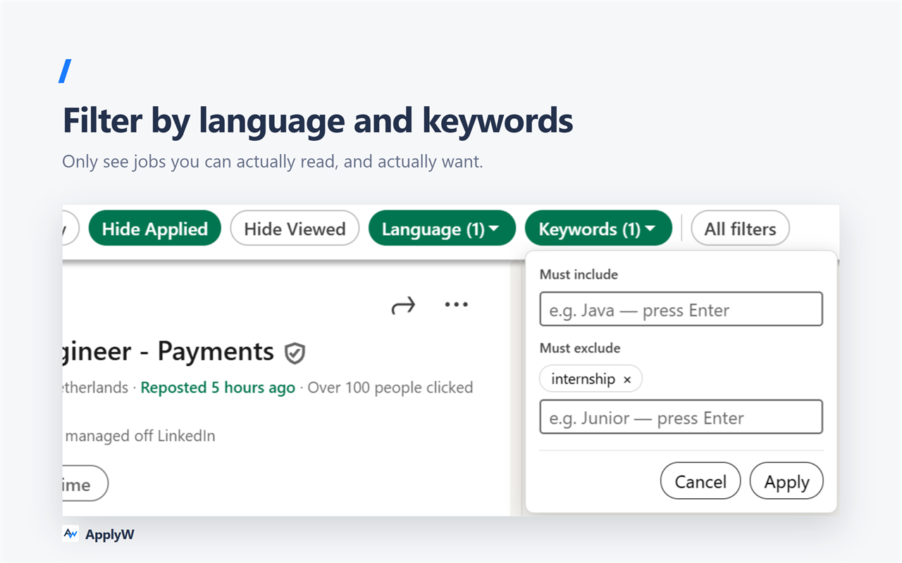
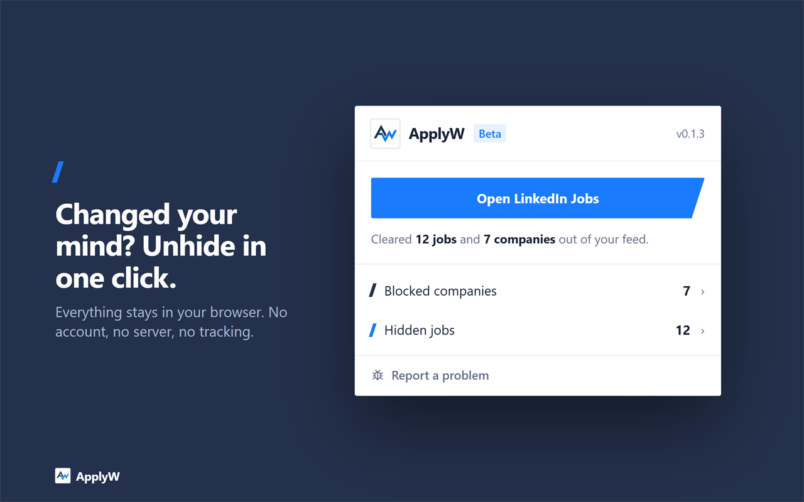

<div align="center">
  

  **Apply Wisely**: Declutter your LinkedIn job search — entirely on your device.

  [](https://applyw.app/)
  [](https://chromewebstore.google.com/detail/imllbmbpfpgnibchclonahimmkjanjhp)
  [](https://github.com/ApplyW/extension/releases/latest)
  [](./LICENSE)
  [](https://developer.chrome.com/docs/extensions/develop/migrate/what-is-mv3)
  [](#status)
  [](https://github.com/ApplyW/extension/issues)

  
</div>

---

LinkedIn's job search gets noisy fast: postings you've already seen or applied
to keep resurfacing, listings show up in languages you don't read, and there's
no quick way to stop seeing a company again. **ApplyW** — *Apply Wisely* — is
a small Chrome extension that fixes that, directly on the search results
page — no account, no server, no data leaving your browser.

> Works on LinkedIn's job search results page
> (`linkedin.com/jobs/search/...`) — other LinkedIn job pages aren't
> supported yet.

## Features

- **Hide** any job with one click — it stays hidden across reloads
- **Block a company** — open a job and block it; every listing from them disappears, immediately and from then on
- **Keyword filter** — require or exclude specific words from a job's title or description (e.g. only show listings mentioning "Java", or hide anything mentioning "Junior")
- **Hide Applied / Hide Viewed** toggles, right next to LinkedIn's own filters (Date Posted, Experience level, ...)
- **Language filter** — see only jobs written in the languages you actually read, picked from a searchable multi-select list. Detected locally from the real job description, not guessed from the title
- **Hidden jobs list** — every job you've hidden, with its title, company, location and when you hid it. Bring back any single one, or all of them at once
- **Blocked companies list** — everything you've blocked, unblockable in one click, with a search box once the list gets long
- **Metrics** — see which of your filters is actually doing the work, ranked, with a breakdown of how many listings each excluded word caught. One click from the popup, shown on the [website](https://applyw.app/#metrics) and read straight out of your own browser

### Language and keyword filters, in LinkedIn's own filter bar



### Everything you've hidden, one click from coming back



## Install

**Chrome Web Store:** [Install ApplyW](https://chromewebstore.google.com/detail/imllbmbpfpgnibchclonahimmkjanjhp)

**From a release:** download `applyw.zip` from the [latest release](https://github.com/ApplyW/extension/releases/latest), unzip it, then in Chrome: `chrome://extensions` → enable **Developer mode** → **Load unpacked** → select the unzipped folder.

**From source:**

```bash
git clone https://github.com/ApplyW/extension.git
cd extension
npm install
npm run build
```

Then in Chrome: `chrome://extensions` → enable **Developer mode** → **Load unpacked** → select the `dist/` folder.

## Privacy

Everything runs locally. ApplyW has no backend, no analytics, no account, and
requests exactly one permission (`storage`) beyond reading the LinkedIn jobs
pages it runs on. Hidden jobs, blocked companies, and your filter settings
are saved in your browser's own extension storage and never sent anywhere.
Full details: [Privacy Policy](./PRIVACY.md).

## Status

Early and free. The plan is to earn real users and real feedback on the core
experience before spending time on anything like account sync — not because
that's ruled out, but because building it before anyone's asked for it would
be solving a problem nobody has yet.

## Development

See [CLAUDE.md](./CLAUDE.md) for the project structure and conventions.

```bash
npm install
npm run dev     # Vite dev server with HMR
npm run build   # production build, outputs to dist/
```

## Related repositories

- [website](https://github.com/ApplyW/website) — the landing page at
  [applyw.app](https://applyw.app/), and the metrics page

## Contributing

Issues and pull requests are welcome — [open an issue](https://github.com/ApplyW/extension/issues)
for a bug or a feature idea.

## License

MIT — see [LICENSE](./LICENSE).
